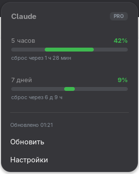

# Claude Usage — GNOME Shell Extension

Monitor your Claude AI subscription limits right in the GNOME top panel — no more digging through settings to check how much quota you have left.



## Features

- **Live quota display** — shows both the 5-hour and 7-day usage windows as percentages in the top bar
- **Color-coded status dot** — green (< 60%), yellow (60–85%), red (> 85%) based on the worst of the two limits
- **Detailed popup** — click the indicator to see progress bars, exact percentages, time until reset, and your subscription plan badge
- **VPN exit-node guard** — optionally verify your VPN country before each request; if the exit node doesn't match, the request is silently skipped to avoid exposing your real IP to Anthropic's servers
- **Manual refresh** — click "Refresh" in the popup to force an immediate update
- **Configurable interval** — set how often the extension polls the API (default: 5 minutes)
- **Preference window** — clean Adwaita UI for all settings

## How it works

The extension uses the same data path as Claude Code itself:

1. Reads your `accessToken` from `~/.claude/.credentials.json` (created when you log in to Claude Code)
2. Calls `https://api.anthropic.com/api/oauth/usage`
3. Parses `five_hour.utilization` and `seven_day.utilization` from the response
4. Displays both values with color-coded progress bars

No scraping, no reverse engineering — this is the official endpoint Anthropic uses to power Claude Code's own quota awareness.

## Requirements

| Requirement | Version |
|---|---|
| GNOME Shell | 46, 47, 48, 49, 50 |
| Claude Code | any (must be logged in at least once) |
| glib-compile-schemas | included in `glib2` / `libglib2.0-bin` |

> **Note:** The extension reads the OAuth token from `~/.claude/.credentials.json`. This file is created by Claude Code during login. If you only use claude.ai in a browser and have never installed Claude Code, this extension will not work.

## Installation

### Option 1 — From source (recommended)

```bash
# Clone the repository
git clone https://github.com/ikrvts/claude-usage-gnome.git
cd claude-usage-gnome

# Install (compiles schema and copies files automatically)
make install

# Log out and back in (required on Wayland), then enable:
gnome-extensions enable claude-usage@gnome
```

### Option 2 — Manual

```bash
UUID="claude-usage@gnome"
DEST="$HOME/.local/share/gnome-shell/extensions/$UUID"

mkdir -p "$DEST/schemas"
cp extension.js prefs.js stylesheet.css metadata.json "$DEST/"
cp schemas/*.xml "$DEST/schemas/"
glib-compile-schemas "$DEST/schemas/"
```

Log out and back in (Wayland), or press `Alt+F2` → `r` (X11 only), then:

```bash
gnome-extensions enable claude-usage@gnome
```

### Option 3 — From zip

```bash
make pack
gnome-extensions install --force claude-usage@gnome.zip
glib-compile-schemas ~/.local/share/gnome-shell/extensions/claude-usage@gnome/schemas/
```

## Uninstall

```bash
make uninstall
# or manually:
rm -rf ~/.local/share/gnome-shell/extensions/claude-usage@gnome
```

## Settings

Open the preferences via the popup menu or `gnome-extensions prefs claude-usage@gnome`.

| Setting | Default | Description |
|---|---|---|
| Panel display | Both | Show both limits (`42% · 9%`) or only the highest one |
| Refresh interval | 5 min | How often to poll the API. Below 3 min risks HTTP 429. |
| Manual first refresh | Off | Don't auto-fetch on login; wait for a click |
| Expected country (ISO) | *(empty)* | VPN exit-node guard — see below |
| Credentials path | *(auto)* | Leave empty; override only if your file is in a non-standard location |

### VPN exit-node guard

If you access Anthropic through a VPN (e.g. Mullvad), you can tell the extension which country your exit node should be in. Before each usage request, it checks the real exit country via `https://www.cloudflare.com/cdn-cgi/trace`. If the country doesn't match, the request is skipped and you get a one-time desktop notification.

To find your country code: open your VPN app and note the server country (Netherlands → `NL`, Germany → `DE`, Sweden → `SE`, United States → `US`, etc.).

Leave the field **empty** if you don't use a VPN or don't need this check.

## Troubleshooting

**Panel shows `!` / popup says "нет токена" (no token)**

Check that the credentials file exists:
```bash
ls -la ~/.claude/.credentials.json
```
If it's missing, open a terminal and run `claude` to log in to Claude Code first.

**Panel shows `401 — токен отклонён`**

Your token may have expired. Run `claude` in a terminal to refresh the session, then click "Refresh" in the popup.

**Panel shows `429 — слишком часто`**

Increase the refresh interval in preferences (5 minutes is the recommended minimum).

**VPN notification fires unexpectedly**

Your Mullvad exit node may have rotated to a different country. Check the VPN app and update the expected country code in preferences.

**Extension not visible after install**

On Wayland (the default on modern Fedora/Ubuntu), a full log out and back in is required after installation. `Alt+F2` → `r` only works on X11.

## Project structure

```
claude-usage-gnome/
├── extension.js     Main extension logic: panel indicator, popup, API calls
├── prefs.js         Preferences window (Adwaita)
├── stylesheet.css   Panel and popup styles
├── metadata.json    Extension manifest (UUID, GNOME Shell versions)
├── Makefile         Install / uninstall / pack helpers
└── schemas/
    └── org.gnome.shell.extensions.claude-usage.gschema.xml
```

## Contributing

Bug reports and pull requests are welcome. For major changes, open an issue first to discuss what you'd like to change.

## Disclaimer

This extension is not affiliated with, endorsed by, or associated with Anthropic. It uses the same OAuth token and API endpoint that the official Claude Code application uses. Use at your own discretion.

## License

MIT — see [LICENSE](LICENSE).
